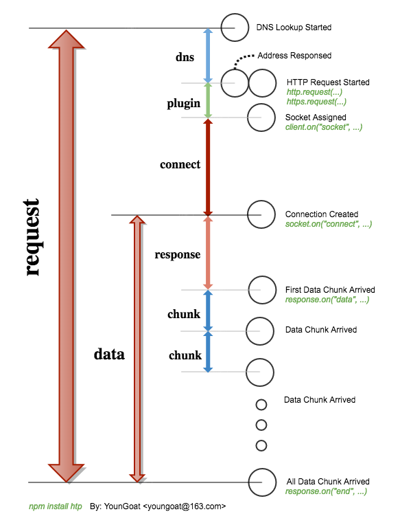

#	htp
__Maybe the easiest but still strong http client you have ever meet.__

[](https://coveralls.io/github/YounGoat/nodejs.htp2?branch=master)

[](https://www.npmjs.com/package/htp)
[](https://www.npmjs.com/package/htp)
[](https://www.npmjs.com/package/htp)
[](https://coveralls.io/github/YounGoat/nodejs.htp2?branch=master)
[](https://david-dm.org/YounGoat/nodejs.htp)
[](https://david-dm.org/YounGoat/nodejs.htp?type=dev)
[](https://travis-ci.org/YounGoat/nodejs.htp)
[](https://github.com/YounGoat/nodejs.htp/stargazers)

>	Languages / [简体中文](./README.zh_CN.md)  
>	If links in this document not avaiable, please access [README on GitHub](./README.md) directly.

##	Table of Contents

* [Description](#description)
* [ToC](#toc)
* [Links](#links)
* [Get Started](#get-started)
* [API](#api)
	* [The Response Object](#the-response-object)
	* [Basic API](#basic-api)
	* [Piping API](#piping-api)
	* [Advanced API](#advanced-api)
	* [Class SimpleAgent](#class-simpleagent)
	* [Timeline](#timeline)
* [About](#about)
* [Recommendations](#recommendations)

##	Description

Another choice for you to finish HTTP or HTTPS request.


##	ToC

*	[Get Started](#get-started)
*	[API](#api)
	-	[Basic API](#basic-api)
	-	[Piping API](#piping-api)
	-	[Advanced API](#advanced-api)
	-	[Class SimpleAgent](#class-simpleagent)
	-	[Timeline](#timeline)
*	[About](#about)
*	[Recommendations](#recommendations)

##	Links

*	[CHANGE LOG](./CHANGELOG.md)
*	[Homepage](https://github.com/YounGoat/nodejs.htp)

##	Get Started

```javascript
var htp = requrie('htp');
// OR, since v0.3.0, an alias "usa" is available.
var htp = require('usa');

// GET & callback
htp.get('http://www.example.com/', function(err, response) {
	if (err) {
		// Exception throwed on requesting.
	}
	else {
		// Response received.
		response.statusCode;
		response.statusMessage;
		response.httpVersion;
		response.headers;
		response.body;
		response.bodyBuffer;
		response.bodyDecompressed;
		response.performance;
	}
});

// POST & promise
var data = { username: 'youngoat', password: 'helloworld' };
htp.post('http://www.example.com/login', data).then(function(response) {
	// ...
}).catch(function(err) {
	// ...
});

// Customized settings.
var client = new htp({
	response_timeout: 1000
});
client.request('GET', 'http://www.example.com/', function(err, response) {
	// ...
});
```

##	API

###	The Response Object

If request achieved successfully, a Response object will be passed. The Response object SHOULD contain the following properties:

*	__response.statusCode__ *number*
*	__response.statusMessage__ *string*
*	__response.httpVersion__ *string*
*	__response.headers__ *Object*
*	__response.body__ *string* | *Object(json)* | *null*  
*	__response.bodyBuffer__ *Buffer* | *null*
*	__response.bodyDecompressed__ 
*	__response.performance__ *Object*

###	Basic API

```javascript
// To execute request with default settings.
htp(
	/*string*/ REQUSET_METHOD_NAME,
	/*string*/ URL,
	/*OPTIONAL object*/ HEADERS,
	/*OPTIONAL string | object | stream.Readable*/ BODY,
	/*OPTIONAL function*/ CALLBACK
);
```

*	*HEADERS*, *BODY* and *CALLBACK* are all optional.
*	__htp__ returns `undefined` while *CALLBACK* offered, otherwise a promise will be returned.
*	__htp__ distinguishes arguments by their types and order. However, it may be ambiguous if there is one, but only one object argument offered. What is it regarded as, *HEADERS* or *BODY*? If the method is defined with explicit payload, the object will be regarded as *BODY*, otherwise it will be regarded as *HEADERS*. See [methods-without-payloads.js](./methods-without-payloads.js) for details.

Another style maybe many coders prefer to is `htp.<lowercase_method_name>( /* ... */ )`, e.g.
```javascript
htp.get('http://www.example.com/', function(error, response) {
	// ...
});
```

Without *CALLBACK* offered, __htp__ will return a promise.
```javascript
htp.get('http://www.example.com/')
	.then(function(response) { /* ... */ })
	.catch(function(error) { /* ... */ })
	;
```

###	Piping API

Since v0.1.0, a streamable subset __htp.piping__ is available. Whether or not *CALLBACK* offered, it will always return a readable stream.
```javascript
htp.piping
	.get('http://download.example.com/data.json')
	.pipe(fs.createWriteStream('data.json'))
	;

// A property function named with "piping" prefixed (in camelCase) is equivalent.
htp
	.pipingGet('http://download.example.com/data.json')
	.pipe(fs.createWriteStream('data.json'))
	；
```

The stream returned by `htp.piping.<method>()` may emit following events:

*	Event: '__dns__'
	-	{ __address__ *string*, __family__ *number* }
*	Event: '__connect__'
*	Event: '__response__'  
	-	__response__ *Object*  
		Along with argument *response* which is a subset of the final response object.
*	events which a readable stream may emit  
	See [Class: stream.Readable](https://nodejs.org/dist/latest/docs/api/stream.html#stream_class_stream_readable) for details.

ATTENTION: Which returned by `htp.piping.<method>()` and then returned by `.pipe()` are not the same stream.

###	Advanced API

```javascript
// Create a customized user-agent.
var request = new htp({
	hostname: 'www.example.com',
});

request.get('/index.html', function(err, response) {
	// ...
});
```

Here are options available when creating a customized user agent:

*	__options.protocol__ *ENUM*('http', 'https')  
	Default protocol.

*	__options.hostname__ *string*  
	Default hostname (port excluded).

*	__options.port__ *number*	 
	Default port.

*	__options.piping__ *boolean*  
	If set true, a readable stream will be returned whether or not *CALLBACK* is present. Otherwise, a promise will be returned when *CALLBACK* is absent.

*	__options.pipingOnly__ *boolean*  
	Only effective in piping mode. If set true, reponse data will no longer be staged and returned, and argument *response* passed to *CALLBACK* will no longer have properties `{ body, bodyBuffer, bodyDcompressed }`. You can only obtain response data through pipe.

*	__options.proxy__ *string*  
	Proxy, e.g. `"http://localhost:8080/"`.

*	__options.request_timeout__ *number* (unit: ms)  
	Max time to finish the whole request.  

*	__options.dns_timeout__ *number* (unit: ms)  
	Max time to resolve hostname.

*	__options.dns_ttl__ *number* (unit: seconds)  
	Time-to-live of DNS resolving result.

*	__options.dnsAgent__ *dns-agent*  
	An instance of [dns-agent](https://www.npmjs.com/package/dns-agent).

*	__options.plugin_timeout__ *number* (unit: ms)  
	Max time to plug into socket.

*	__options.connect_timeout__ *number* (unit: ms)  
	Max time to shake-hands with target server.

*	__options.response_timeout__ *number* (unit: ms)  
	Max time to recieve the first response from target server.

*	__options.chunk_timeout__ *number* (unit: ms)  
	Max time two data chunks.

*	__options.data_timeout__ *number* (unit: ms)  
	Max time to receive all data.

Some options from [tls.connect()](https://nodejs.org/dist/latest/docs/api/tls.html#tls_tls_connect_options_callback) are also accepted and will be applied on HTTPs requests:

*	__options.rejectUnauthorized__ *boolean*  

See [settings.js](./settings.js) for default values of options.

###	Class SimpleAgent

By creating an instance of __SimpleAgent__, developers are able to create a customized and resuable __htp__.

```javascript
var Agent = require('htp/SimpleAgent');

// Create an instance.
var agent = new Agent({
	endPoint: 'http://www.example.com/'
});

var p = agent.get('/index.html');
p.then(function(bodyBuffer) {
	console.log(bodyBuffer.toString('utf8'));
}).catch(function(err) {
	// ...
});
```

Acceptable options accepted by __htp/SimpleAgent__ are:

*	*Function* __beforeRequest__({ method, url, headers, body, callback })  
	If offered, this function will be invoked with an object passed in before real HTTP request starts. The passed in object is made up five properties. The function SHOULD return void or an object made up all or some of the properties. If an object returned, the properties will be used on requesting.
*	*Function* __beforeCallback__(error, data)  
	If offered, this function will be invoked before callback invoked. The returned value will be used as real data and passed to `callback(null, data)` or `resolve(data)`.
*	*string* __endPoint__  
*	*object* __headers__
*	*object* __query__
*	*object* __settings__  
	Settings used to customise the user-agent. See [Advanced API](#advanced-api).

###	Timeline

Here is the timeline of an __htp__ request:  


##  About

For convenience, this package has following names (alias):
*   [htp](https://www.npmjs.com/package/htp)  
	Because the main business of this package is to execute HTTP/HTTPS requests, I named it *htp* which looks like *http* with double *t* replaced by one.

*   [usa](https://www.npmjs.com/package/usa)  
	It is not the United States of America. *usa* is abbreviation of *USerAgent*.

##	Recommendations

*	[osapi](https://www.npmjs.com/package/osapi) or [ceph](https://www.npmjs.com/package/ceph)
*	[urx](https://www.npmjs.com/package/urx)
*	[proksy](https://www.npmjs.com/package/proksy)
