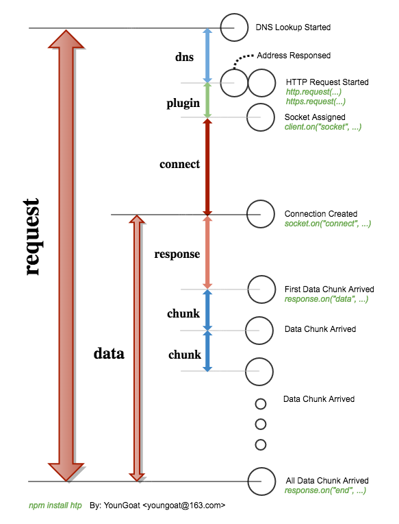

#	htp
__Maybe the easiest but still strong http client you have ever meet.__

[](https://www.npmjs.com/package/htp)
[](https://www.npmjs.com/package/htp)
[](https://www.npmjs.com/package/htp)
[](https://coveralls.io/github/YounGoat/nodejs.htp2?branch=master)
[](https://david-dm.org/YounGoat/nodejs.htp)
[](https://david-dm.org/YounGoat/nodejs.htp?type=dev)
[](https://travis-ci.org/YounGoat/nodejs.htp)
[](https://github.com/YounGoat/nodejs.htp/stargazers)

其他语言 / [English](./README.md)

##	目录

*	[快速开始](#快速开始)
*	[API](#api)
	-	[Basic API](#basic-api)
	-	[Piping API](#piping-api)
	-	[Advanced API](#advanced-api)
	-	[Class SimpleAgent](#class-simpleagent)
	-	[时间轴](#timeline)

##	链接

*	[更新日志](./CHANGELOG.md)
*	[主页](https://github.com/YounGoat/nodejs.htp)

##	快速开始

```javascript
var htp = requrie('htp');

// GET & callback
htp.get('http://www.example.com/', function(err, response) {
	if (err) {
		// Exception throwed on requesting.
	}
	else {
		// Response received.
		response.statusCode;
		response.statusMessage;
		response.httpVersion;
		response.headers;
		response.body;
		response.bodyBuffer;
		response.bodyDecompressed;
		response.performance;
	}
});

// POST & promise
var data = { username: 'youngoat', password: 'helloworld' };
htp.post('http://www.example.com/login', data).then(function(response) {
	// ...
}).catch(function(err) {
	// ...
});

// Customized settings.
var client = new htp({
	response_timeout: 1000
});
client.request('GET', 'http://www.example.com/', function(err, response) {
	// ...
});
```

##	API

###	Basic API

```javascript
// To execute request with default settings.
htp(
	/*string*/ REQUSET_METHOD_NAME,
	/*string*/ URL,
	/*OPTIONAL object*/ HEADERS,
	/*OPTIONAL string | object | stream.Readable*/ BODY,
	/*OPTIONAL function*/ CALLBACK
);
```

*	*HEADERS*, *BODY* 以及 *CALLBACK* 参数是可选的。
*	如果 *CALLBACK* 缺省，__htp__ 返回 `undefined`；否则返回 `Promise` 实例。
*	__htp__ 依赖参数的类型与次序区分其含义。当实参列表中有且仅一个对象类型参数时，如果此时的 HTTP 方法要求携带载荷（比如 POST 方法），则该对象参数将被视为 *BODY*，否则将被视为 *HEADERS*。请参考 [methods-without-payloads.js](./methods-without-payloads.js) 以获取更多细节.

我们还可以使用形如 `htp.<lowercase_method_name>( /* ... */ )` 的语法, e.g.
```javascript
htp.get('http://www.example.com/', function(error, response) {
	// ...
});
```

当缺省 *CALLBACK* 参数时，__htp__ 返回一个 `Promise` 实例：
```javascript
htp.get('http://www.example.com/')
	.then(function(response) { /* ... */ })
	.catch(function(error) { /* ... */ })
	;
```

###	Piping API

从 v0.1.0 开始，我们可以通过 __htp.piping__ 实现对响应数据的流式处理。无论调用的时候是否提供 *CALLBACK* 参数，该系统方法均会返回一个可读流对象。

```javascript
htp.piping
	.get('http://download.example.com/data.json')
	.pipe(fs.createWriteStream('data.json'))
	;

// A property function named with "piping" prefixed (in camelCase) is equivalent.
htp
	.pipingGet('http://download.example.com/data.json')
	.pipe(fs.createWriteStream('data.json'))
	；
```

`htp.piping.<method>()` 方法返回的可读流对象支持以下事件：

*	Event: '__dns__'
	-	{ __address__ *string*, __family__ *number* }  
		该事件携带一个解析地址结果对象。
*	Event: '__connect__'
*	Event: '__response__'  
	-	__response__ *Object*  
		该事件携带一个对象类型参数 response，该对象是最终响应对象的真子集。
*	可读流对象默认支持的其他事件  
	参见 [Class: stream.Readable](https://nodejs.org/dist/latest/docs/api/stream.html#stream_class_stream_readable)。

注意：返回值经过再一次 `.pipe()` 方法之后，新的返回值已经不是原来的流对象。


###	Advanced API

```javascript
// Create a customized user-agent.
var request = new htp({
	hostname: 'www.example.com',
});

request.get('/index.html', function(err, response) {
	// ...
});
```

以下选项可以用来定制用户代理：

*	__options.protocol__ *ENUM*('http', 'https')  
	默认协议。

*	__options.hostname__ *string*  
	默认主机名（不含端口号）。

*	__options.port__ *number*	 
	默认端口号。

*	__options.piping__ *boolean*   
	此开关开启时，__htp__ 会返回一个可读流对象，以支持透过管道读取响应中的载荷数据。

*	__options.pipingOnly__ *boolean*  
	此开关仅在 piping 模式下有效。开启时，响应数据将不再被缓存和返回，*CALLBACK* 中传递的 __response__ 对象不再包含 `{ body, bodyBuffer, bodyDcompressed }` 属性。你只能透过管道获取响应数据。

*	__options.proxy__ *string*  
	代理。例如：`"http://localhost:8080/"`。

*	__options.request_timeout__ *number* (unit: ms)  
	请求从发起到接收响应完毕的最大允许时间。

*	__options.dns_timeout__ *number* (unit: ms)  
	用于解析主机名的最大允许时间。

*	__options.plugin_timeout__ *number* (unit: ms)  
	用于打开 socket 的最大允许时间。

*	__options.connect_timeout__ *number* (unit: ms)  
	用于与目标服务完成握手的最大允许时间。

*	__options.response_timeout__ *number* (unit: ms)  
	从发起请求到首个响应数据块抵达的最大允许时间。

*	__options.chunk_timeout__ *number* (unit: ms)  
	两个响应数据块之间的最大允许时间间隔。

*	__options.data_timeout__ *number* (unit: ms)  
	从开始接收数据到所有数据接收完毕的最大允许时间。

选自 [tls.connect()](https://nodejs.org/dist/latest/docs/api/tls.html#tls_tls_connect_options_callback) 的部分选项也将被采纳，并应用于 HTTPS 请求中：

*	__options.rejectUnauthorized__ *boolean*  
	是否拒绝未经认证的（不安全的）响应。

请查阅 [settings.js](./settings.js) 以获取上述选项的默认值。

###	Class SimpleAgent

通过实例化 __SimpleAgent__ 类，开发者可以创建一个定制化、可利用的用户代理。

```javascript
var Agent = require('htp/SimpleAgent');

// Create an instance.
var agent = new Agent({
	endPoint: 'http://www.example.com/'
});

var p = agent.get('/index.html');
p.then(function(bodyBuffer) {
	console.log(bodyBuffer.toString('utf8'));
}).catch(function(err) {
	// ...
});
```

实例化 __htp/SimpleAgent__ 时可以使用以下选项： 

*	*Function* __beforeRequest__({ method, url, headers, body, callback })  
	该方法将在发起 HTTP 请求前被调用，传入的对象包含 5 个属性。该方法 __应当__ 返回 `void` 或是由上述全部或部分属性组成的对象，这些返回的属性将被应用于即将发起的 HTTP 请求。
*	*Function* __beforeCallback__(error, data)  
	该方法将在调用回调函数之前被调用，其他返回值将作为回调数据传给 `callback(null, data)` or `resolve(data)`。
*	*string* __endPoint__  
*	*object* __headers__
*	*object* __query__
*	*object* __settings__  
	用于定制用户代理的参数，参见 [Advanced API](#advanced-api) 一节。

###	Timeline

以下是 __htp__ 请求的时间轴示意图：  
